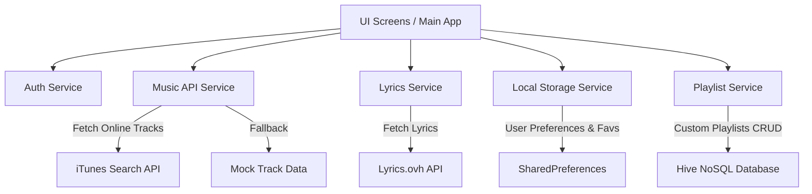

# 🎵 BLUEPRINT & RENCANA KERJA PENGEMBANGAN APLIKASI MUSIK MELODYA

Dokumen ini adalah **Blueprint (Rencana Kerja) Lengkap dan Terintegrasi** untuk aplikasi musik **Melodya** berbasis Flutter. Dokumen ini dirancang sebagai satu file panduan utama yang mencakup analisis arsitektur saat ini, skema data, alur kerja (user flow), hingga peta jalan (roadmap) pengembangan fitur di masa depan.

---

## 📌 DAFTAR ISI
1. [Eksplorasi Umum & Visi Aplikasi](#1-eksplorasi-umum--visi-aplikasi)
2. [Arsitektur Sistem & Stack Teknologi Saat Ini](#2-arsitektur-sistem--stack-teknologi-saat-ini)
3. [Struktur Direktori & Pemetaan Kode Sumber](#3-struktur-direktori--pemetaan-kode-sumber)
4. [Skema Penyimpanan & Manajemen Data Lokal](#4-skema-penyimpanan--manajemen-data-lokal)
5. [Analisis Fitur Utama & Alur Pengguna (User Flow)](#5-analisis-fitur-utama--alur-pengguna-user-flow)
6. [Roadmap Pengembangan & Rencana Kerja Masa Depan (Milestones)](#6-roadmap-pengembangan--rencana-kerja-masa-depan-milestones)
7. [Metodologi Pengujian & Rencana Verifikasi (Testing Plan)](#7-metodologi-pengujian--rencana-verifikasi-testing-plan)
8. [Panduan Pemecahan Masalah (Troubleshooting Guide)](#8-panduan-pemecahan-masalah-troubleshooting-guide)

---

## 1. EKSPLORASI UMUM & VISI APLIKASI

**Melodya** adalah aplikasi pemutar musik modern berbasis Flutter yang dirancang untuk memberikan pengalaman mendengarkan musik yang intuitif, visual yang indah, dan interaktif. Melodya menggabungkan pencarian musik dinamis secara online dengan kontrol penyimpanan lokal untuk mempersonalisasi daftar putar, melacak artis favorit, menyimpan riwayat pemutaran, serta menyajikan lirik lagu secara instan.

### Visi Utama:
*   **Aksesibilitas Tinggi**: Menghubungkan pengguna dengan jutaan trek musik melalui integrasi API publik.
*   **Desain Premium & Dinamis**: Memanfaatkan skema warna gradasi modern, efek transisi halus, dan komponen UI yang responsif (konsisten dengan tema gelap navy dan pink neon `0xFFD946EF`).
*   **Kemandirian Data**: Mengandalkan arsitektur penyimpanan lokal yang tangguh (*SharedPreferences* & *Hive NoSQL*) sebelum melakukan transisi penuh ke infrastruktur cloud (Firebase/Supabase).

---

## 2. ARSITEKTUR SISTEM & STACK TEKNOLOGI SAAT INI

Melodya dibangun menggunakan arsitektur modular yang memisahkan antara **Lapis Tampilan (UI Screens)**, **Lapis Layanan (Services)**, dan **Lapis Model Data (Models)**. Pendekatan ini memastikan kode mudah dipelihara (maintainable) dan diskalakan (scalable).



### Stack Teknologi Saat Ini:
1.  **Framework Utama**: Flutter & Dart (Mendukung Multi-platform: Android, iOS, Web, Windows, macOS).
2.  **State & Data Persistence (Lokal)**:
    *   `shared_preferences`: Untuk menyimpan preferensi pengguna, status login, riwayat lagu terakhir (recently played), daftar favorit, dan artis yang diikuti.
    *   `hive_flutter` (Hive NoSQL): Database lokal performa tinggi untuk mendukung manajemen playlist kustom pengguna.
3.  **Jaringan & API**:
    *   `http`: Untuk melakukan request data ke iTunes Search API dan Lyrics.ovh API.
4.  **Desain UI & Ikon**:
    *   `flutter/material.dart`: Menggunakan Material Design 3 dengan kustomisasi tema premium (Dark Mode, warna aksen pink neon dan Slate Navy).

---

## 3. STRUKTUR DIREKTORI & PEMETAAN KODE SUMBER

Berikut adalah peta struktur proyek Melodya saat ini yang terstruktur rapi:

```
lib/
│
├── models/
│   └── music_track.dart         # Representasi data lagu (Model objek Track)
│
├── services/
│   ├── auth_service.dart        # Manajemen login lokal (Username & Status Login)
│   ├── local_storage_service.dart# Manajemen data Favorit, Followed, & Recently Played
│   ├── playlist_service.dart    # Operasi database NoSQL Hive untuk Playlist pengguna
│   ├── music_api_service.dart   # Pencarian lagu online via iTunes & Mock data
│   └── lyrics_service.dart      # Integrasi fetch lirik lagu via lyrics.ovh API
│
├── screens/
│   ├── login_screen.dart        # Halaman autentikasi lokal / mode tamu (guest mode)
│   ├── lyrics_screen.dart       # Layar visualisasi lirik lagu yang dinamis & indah
│   ├── settings_screen.dart     # Halaman kustomisasi audio, notifikasi, tema & info aplikasi
│   └── add_song_sheet.dart      # Bottom sheet untuk menambahkan lagu ke playlist
│
└── main.dart                    # Core entry-point aplikasi (Audio player, Home, Search, Playlists)
```

---

## 4. SKEMA PENYIMPANAN & MANAJEMEN DATA LOKAL

Melodya memanfaatkan penyimpanan lokal untuk memastikan aplikasi tetap bekerja dengan sangat cepat tanpa memerlukan database backend yang mahal pada tahap awal.

### A. Skema SharedPreferences (`LocalStorageService` & `AuthService`)

| Nama Key | Tipe Data | Deskripsi / Skema Nilai |
| :--- | :--- | :--- |
| `local_username` | `String` | Menyimpan nama tampilan profil pengguna yang diisi saat login. |
| `local_is_logged_in` | `bool` | Flag boolean status apakah pengguna sudah login atau menggunakan guest mode. |
| `local_favorites` | `String` (JSON List) | Menyimpan list lagu favorit yang di-encode ke JSON. Skema: `[{id, title, artist, imageUrl, audioUrl, color, icon}]` |
| `local_followed` | `String` (JSON List) | Menyimpan daftar artis/lagu yang di-follow pengguna. Skema sama seperti format lagu favorit. |
| `local_recent` | `String` (JSON List) | Menyimpan riwayat lagu yang baru-baru ini diputar (maksimal 15 lagu terakhir). |

### B. Skema Database Hive (`PlaylistService`)
Menggunakan Hive Box dengan nama `melodya_playlists`. Struktur data yang disimpan berupa daftar map playlist kustom:

```json
[
  {
    "name": "Late Night Jazz",
    "trackTitles": ["Blue in Green", "My Funny Valentine"],
    "colorValue": 4279844926, 
    "iconCodepoint": 58389
  }
]
```

*   `name`: Nama playlist (Unik, digunakan sebagai identifier).
  *   `trackTitles`: Array dari string judul lagu yang dimasukkan ke playlist tersebut.
  *   `colorValue`: Nilai integer warna tema playlist (untuk kartu visual).
  *   `iconCodepoint`: Kode int ikon Material design (untuk ikon khusus playlist).

---

## 5. ANALISIS FITUR UTAMA & ALUR PENGGUNA (USER FLOW)

Berikut adalah detail fungsionalitas dan alur interaksi pengguna untuk setiap fitur utama di Melodya:

### 1. Sistem Autentikasi Hibrida (`AuthService` & `LoginScreen`)
*   **Fitur**: Pengguna dapat masuk menggunakan nama mereka untuk mempersonalisasi sapaan di beranda (misal: "Halo, Budi! 👤"). Tersedia tombol "Mulai Dengarkan" (Mode Tamu / Guest Mode) jika ingin melewati proses ini secara cepat.
*   **Alur**: 
    1. Pengguna membuka aplikasi -> Jika belum login, diarahkan ke `LoginScreen`.
    2. Masukkan nama -> Klik "Masuk" (Nama disimpan ke `local_username` via `AuthService`).
    3. Atau klik "Mulai Dengarkan" -> Diarahkan langsung ke Home.

### 2. Pencarian Musik Online (`MusicApiService` & `main.dart`)
*   **Fitur**: Input pencarian real-time dengan debouncing 500ms yang secara otomatis mengirimkan request ke iTunes Search API untuk trek dengan kualitas preview audio yang aman. Jika koneksi offline/gagal, aplikasi otomatis memberikan lagu alternatif (Mock Tracks: *Beautiful Dawn* & *Urban Beats*).
*   **Alur**: 
    1. Pengguna mengetik nama lagu/artis di bilah pencarian (Search Tab).
    2. Aplikasi mem-fetch hasil -> Menampilkan daftar lagu lengkap dengan cover art, judul, dan artis.

### 3. Pemutar Musik Interaktif (Interactive Player)
*   **Fitur**: Player terintegrasi di bagian bawah (mini player) dan layar penuh yang mendukung pemutaran audio, jeda (play/pause), pengaturan slider durasi pemutaran, visualisasi gelombang lagu, tombol favorit cepat, tombol ikuti artis, dan tombol akses lirik lagu. Pemutaran lagu secara otomatis memasukkan lagu tersebut ke daftar *Recently Played* (maksimal 15 lagu).

### 4. Penampil Lirik Dinamis (`LyricsService` & `LyricsScreen`)
*   **Fitur**: UI modern berlapis warna gradasi semi-transparan berdasarkan warna dasar trek lagu. Lirik diambil secara real-time dari API `lyrics.ovh` dengan fitur *fallback* otomatis (misal: mencoba mencari lirik dengan memotong nama artis ke kata pertama jika pencarian nama penuh gagal). Dilengkapi state loading dan error handling yang ramah pengguna.
*   **Alur**:
    1. Pengguna mengetik ikon lirik (🎵) pada daftar lagu.
    2. Aplikasi memanggil `fetchLyricsWithFallback(artist, title)`.
    3. Menampilkan layar loading -> Lirik muncul dengan font nyaman dan dapat di-scroll.

### 5. Manajemen Playlist Kustom (`PlaylistService` & `AddSongSheet`)
*   **Fitur**: Pengguna dapat membuat playlist baru dengan ikon kustom dan warna latar belakang yang unik. Pengguna dapat dengan mudah memasukkan lagu dari hasil pencarian apa saja ke dalam satu atau beberapa playlist sekaligus melalui bottom sheet interaktif.
*   **Alur**:
    1. Ketik ikon tambah lagu (➕).
    2. Bottom sheet `AddSongSheet` muncul menampilkan daftar playlist yang tersedia dengan checkbox.
    3. Centang playlist yang diinginkan -> Lagu tersimpan secara permanen di database lokal Hive.

---

## 6. ROADMAP PENGEMBANGAN & RENCANA KERJA MASA DEPAN (MILESTONES)

Untuk meningkatkan kualitas aplikasi Melodya ke tingkat premium kelas dunia, berikut adalah rencana kerja terperinci yang dibagi menjadi **4 Milestones Utama**:

```
🚀 ROADMAP MELODYA
├── Milestone 1: Offline Experience & Optimasi Cache (Fokus: Kecepatan & Stabilitas)
├── Milestone 2: Audio Player Tingkat Lanjut & Lirik Tersinkronisasi (Fokus: Fitur Core Player)
├── Milestone 3: Migrasi Backend Cloud & Sinkronisasi Real-time (Fokus: Skalabilitas & Sosial)
└── Milestone 4: Fitur Sosial, Personalisasi Cerdas, & AI (Fokus: Keterlibatan Pengguna)
```

---

### 🚀 MILESTONE 1: Offline Experience & Optimasi Cache (Fokus pada Kecepatan & Stabilitas)
Tujuan dari milestone ini adalah memastikan pengguna tetap dapat menikmati musik dan lirik meskipun koneksi internet tidak stabil.

#### 📋 Daftar Tugas & Rencana Kerja:
- [ ] **Sistem Offline Caching Lirik**:
  - Mengubah `LyricsService` agar menyimpan lirik yang berhasil di-fetch secara lokal di Hive database.
  - Saat pengguna membuka lirik lagu yang sama, aplikasi akan membacanya secara instan dari cache lokal (tanpa memicu request HTTP).
- [ ] **Audio Downloader & Offline Player**:
  - Mengintegrasikan paket `flutter_cache_manager` atau `path_provider` untuk mengunduh preview lagu `.mp4`/`.mp3` ke penyimpanan lokal.
  - Menambahkan indikator unduhan (icon download) pada setiap trek lagu.
  - Memungkinkan pemutaran lagu yang diunduh secara offline penuh.
- [ ] **Optimasi Gambar (Cover Art)**:
  - Menggunakan paket `cached_network_image` untuk semua gambar cover art artis dan album agar meminimalisir konsumsi kuota data dan menghilangkan efek berkedip (flickering) saat memuat gambar.

---

### 🚀 MILESTONE 2: Audio Player Tingkat Lanjut & Lirik Tersinkronisasi (Fokus pada Fitur Core Player)
Meningkatkan kualitas pemutaran audio dan interaksi lirik agar sekelas Spotify atau Apple Music.

#### 📋 Daftar Tugas & Rencana Kerja:
- [ ] **Lirik Tersinkronisasi Waktu (Time-Synced Lyrics)**:
  - Membuat parser file `.lrc` (Lirik Tersinkronisasi berbasis penanda waktu seperti `[00:12.34] lirik lagu`).
  - Mengembangkan UI auto-scrolling di `LyricsScreen` yang secara otomatis menggeser teks lirik dan memberikan efek highlight (sorotan warna cerah) pada baris lirik yang sedang dinyanyikan sesuai posisi detik lagu.
- [ ] **Background Audio & Integrasi Sistem Operasi**:
  - Mengintegrasikan paket `just_audio` dan `audio_service` untuk mendukung pemutaran latar belakang (background playback).
  - Menampilkan media controller di lock screen handphone dan notification drawer (mendukung play, pause, next, dan info lagu).
- [ ] **Equalizer Audio & Mode Efek Suara**:
  - Menambahkan fitur pengaturan equalizer frekuensi suara (Bass Boost, Treble, Vocal, Classic, dll.) pada `SettingsScreen`.

---

### 🚀 MILESTONE 3: Migrasi Backend Cloud & Sinkronisasi Real-time (Fokus pada Skalabilitas & Sosial)
Memindahkan data pengguna dari penyimpanan lokal offline (SharedPreferences/Hive) ke database cloud yang aman sehingga dapat diakses dari berbagai perangkat.

#### 📋 Daftar Tugas & Rencana Kerja:
- [ ] **Integrasi Firebase/Supabase (Autentikasi Nyata)**:
  - Mengganti login lokal dengan Firebase Authentication atau Supabase Auth (Mendukung Login Google, Apple, dan Email/Password).
- [ ] **Sinkronisasi Database Cloud**:
  - Membuat database relasional di Supabase atau Cloud Firestore untuk menyimpan data profil pengguna, playlist kustom, riwayat mendengarkan, dan trek favorit secara online.
  - Mengimplementasikan sinkronisasi otomatis: saat aplikasi offline, data disimpan di Hive, dan ketika terhubung kembali ke internet, data disinkronkan ke Cloud secara otomatis.
- [ ] **Fitur Kolaborasi Playlist**:
  - Memungkinkan pengguna untuk membagikan tautan (link) playlist mereka ke publik atau mengundang teman untuk menambahkan lagu bersama ke satu playlist yang sama.

---

### 🚀 MILESTONE 4: Fitur Sosial, Personalisasi Cerdas, & AI (Fokus pada Keterlibatan Pengguna)
Menambahkan sentuhan akhir yang inovatif untuk meningkatkan retensi pengguna dengan rekomendasi musik bertenaga kecerdasan buatan.

#### 📋 Daftar Tugas & Rencana Kerja:
- [ ] **Mesin Rekomendasi Musik Cerdas (AI Recommendation)**:
  - Menganalisis kebiasaan mendengarkan pengguna (lagu paling sering diputar, genre favorit) dan menyajikan playlist otomatis yang disesuaikan setiap harinya (misal: "Rekomendasi Harian Untukmu").
- [ ] **Lyrics Share Card Generator**:
  - Fitur untuk memilih 1-3 baris lirik lagu favorit pengguna, lalu meng-generate kartu grafis estetik yang berisi teks lirik tersebut, nama artis, judul lagu, dan QR code lagu untuk langsung dibagikan ke Instagram Stories atau WhatsApp Status.
- [ ] **Penerjemahan Lirik Multi-Bahasa**:
  - Mengintegrasikan API penerjemah gratis (atau serverless function) untuk menampilkan terjemahan lirik asing ke bahasa Indonesia secara berdampingan.

---

## 7. METODOLOGI PENGUJIAN & RENCANA VERIFIKASI (TESTING PLAN)

Untuk memastikan keandalan mutlak dari fitur-fitur yang dikembangkan di Melodya, berikut adalah rencana pengujian berkala:

### A. Pengujian Unit & Integrasi (Automated Testing)
1.  **Unit Test Model & Parsing JSON**:
    *   Menguji berkas `lib/models/music_track.dart` apakah parsing data dari API iTunes terbebas dari error saat terdapat field bernilai null.
2.  **Unit Test Services**:
    *   Menguji `LyricsService` menggunakan mock HTTP client untuk menguji respon sukses (200), lirik tidak ditemukan (404), dan kondisi timeout jaringan.
3.  **Widget & Integration Test**:
    *   Menguji fungsionalitas UI seperti penekanan tombol navigasi, penambahan playlist di `AddSongSheet`, serta pengisian input teks pencarian lagu.

### B. Pengujian Manual (Manual Testing Checklist)

| Modul Fitur | Skenario Pengujian | Hasil yang Diharapkan | Status |
| :--- | :--- | :--- | :--- |
| **Auth** | Klik "Mulai Dengarkan" tanpa mengisi nama. | Aplikasi masuk ke Home, sapaan tertulis "Halo, Pengguna! 👤". | [ ] |
| **Auth** | Mengisi nama "Farhan" dan klik login. | Aplikasi masuk ke Home, sapaan berubah menjadi "Halo, Farhan! 👤". | [ ] |
| **Search** | Mencari dengan keyword "Ed Sheeran". | List menampilkan lagu-lagu populer milik Ed Sheeran dari iTunes. | [ ] |
| **Search** | Mematikan internet, lalu mencari lagu baru. | Aplikasi menampilkan pesan "Koneksi Bermasalah" / Fallback ke mock tracks. | [ ] |
| **Lyrics** | Mengklik tombol lirik (🎵) pada lagu populer. | Layar Loading muncul sebentar, lirik lagu muncul secara penuh dengan background gradient. | [ ] |
| **Lyrics** | Mengklik tombol lirik pada lagu fiktif / instrumen tanpa lirik. | Aplikasi menampilkan teks informatif "Lirik tidak ditemukan". | [ ] |
| **Playlists**| Membuat playlist baru -> menambahkan 3 lagu -> merestart aplikasi. | Playlist kustom tetap tersimpan utuh berkat persistensi Hive NoSQL. | [ ] |
| **Audio** | Memutar lagu -> menekan pause -> menggeser posisi slider. | Suara terjeda seketika, dan slider berpindah posisi secara akurat tanpa stuttering. | [ ] |

---

## 8. PANDUAN PEMECAHAN MASALAH (TROUBLESHOOTING GUIDE)

Sebagai developer atau maintainer aplikasi Melodya, berikut adalah masalah umum yang mungkin ditemui beserta solusinya:

### 1. Error: "HiveError: Box not opened..."
*   **Penyebab**: Terjadi karena mencoba memanggil `PlaylistService` sebelum database Hive diinisialisasi secara sempurna.
*   **Solusi**: Pastikan di `main.dart` sebelum `runApp()`, fungsi `Hive.initFlutter()` dan `PlaylistService.init()` telah dipanggil dengan keyword `await`.

### 2. Masalah: Lirik sering tidak ditemukan (Error 404 / Null)
*   **Penyebab**: API `lyrics.ovh` sangat sensitif terhadap karakter spesial, tanda kurung (seperti *(Remastered)*, *(Live)*), atau nama artis yang terlalu panjang.
*   **Solusi**:
    *   Implementasikan regex pembersih teks pada `LyricsService` sebelum mengirim URL request (saat ini sudah diimplementasikan dasar pembersihan di `fetchLyrics`).
    *   Jika lirik lagu indie/lokal sering kosong, disarankan untuk mengupgrade service ke API **Musixmatch** (memerlukan API key gratis) atau API **Genius** untuk basis data lirik terlengkap di dunia.

### 3. Masalah: Audio lag atau lambat memuat saat pertama kali dimainkan
*   **Penyebab**: Trek lagu dialirkan secara streaming langsung dari server iTunes (audio preview).
*   **Solusi**: Terapkan implementasi caching file audio yang tercantum di **Milestone 1** untuk mengunduh lagu ke cache lokal perangkat sebelum memainkannya.

---

## 🏁 KESIMPULAN & LANGKAH SELANJUTNYA

Blueprint ini dirancang sebagai satu dokumen panduan kerja terpadu untuk tim pengembangan aplikasi **Melodya**. Dengan mengikuti milestone yang terarah ini, Melodya akan berevolusi dari pemutar musik lokal sederhana menjadi aplikasi streaming musik canggih berskala cloud dengan fungsionalitas lirik tersinkronisasi yang kaya fitur dan premium.

> **Rekomendasi Langkah Berikutnya**:
> Mulailah pengerjaan **Milestone 1 (Offline Caching & Image Optimization)** sebagai fondasi utama sebelum menyentuh sinkronisasi audio tingkat lanjut di Milestone 2.
